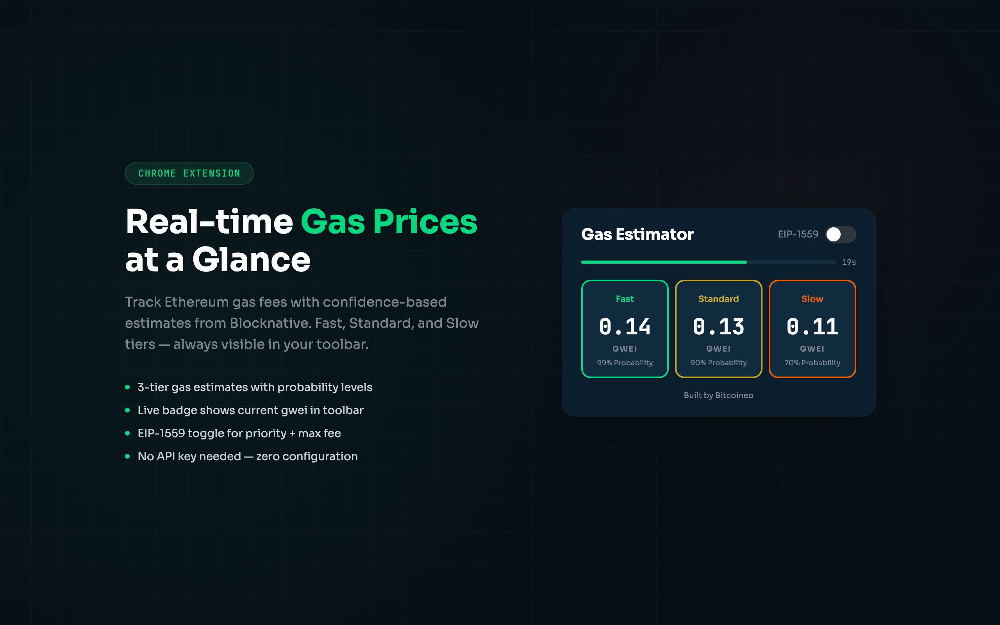
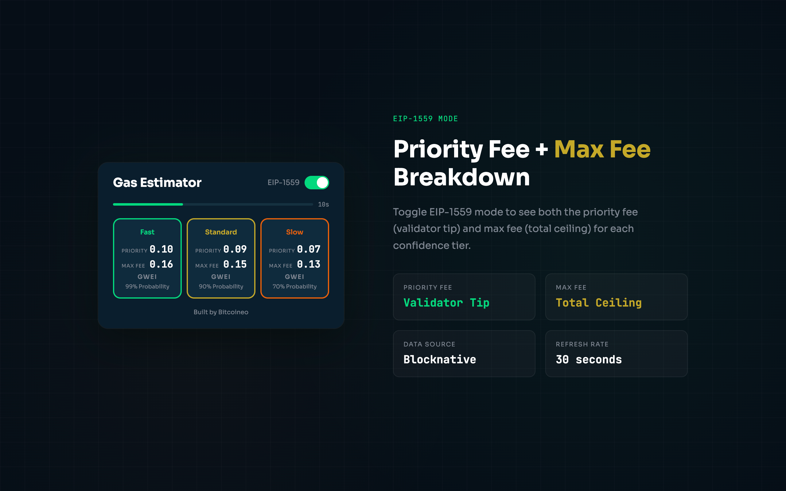

# ETH Gas Tracker

Chrome extension that shows real-time Ethereum gas prices using the [Blocknative Gas Platform API](https://www.blocknative.com/gas-platform) — no API key required.

<!-- TODO: Replace with actual Chrome Web Store link after publishing -->
<!-- [Install from Chrome Web Store](https://chrome.google.com/webstore/detail/YOUR_EXTENSION_ID) -->

## Features

- **3 gas tiers** — Fast (99%), Standard (90%), Slow (70%) confidence levels
- **EIP-1559 toggle** — switch between legacy gas price and maxFeePerGas
- **Live badge** — current gwei estimate on the extension icon, color-coded by price
- **Block progress bar** — visual countdown to next data refresh (~13s)
- **Zero config** — works out of the box, no API key needed

## Screenshots


*Legacy mode — single gas price per tier*


*EIP-1559 mode — priority fee + max fee breakdown*

## Install

### From Chrome Web Store

> Coming soon — link will be added after publishing.

### From Source

1. Clone this repo
2. Open `chrome://extensions`
3. Enable **Developer mode** (top right)
4. Click **Load unpacked** and select the project folder

## File Structure

```
├── background.js    # Blocknative API polling, badge updates
├── popup.html       # Extension popup layout
├── popup.js         # Popup rendering, toggle, progress bar
├── popup.css        # Dark theme styles
├── manifest.json    # Chrome MV3 manifest
├── icons/           # Extension icons (16, 48, 128px)
└── store/           # Chrome Web Store assets
    ├── privacy-policy.html
    ├── store-description.txt
    ├── permission-justifications.txt
    └── single-purpose.txt
```

## Tech Stack

- Chrome Extension Manifest V3
- [Blocknative Gas Platform API](https://docs.blocknative.com/gas-prediction/gas-platform) (free, no key)
- Vanilla JS/CSS, no dependencies

## Credits

Built by [Bitcoineo](https://github.com/Bitcoineo) — gas data from [Blocknative](https://www.blocknative.com).
